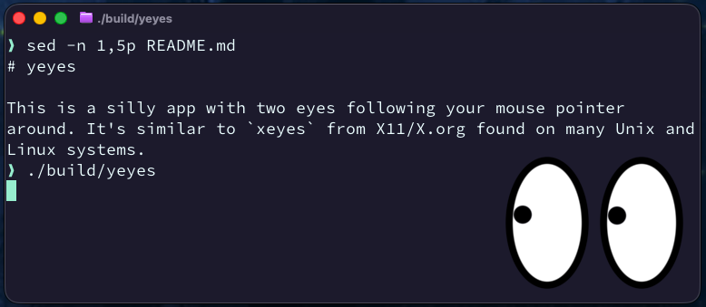

# yeyes



This is a silly app with two eyes following your mouse pointer
around. It's similar to `xeyes` from X11/X.org found on many Unix and
Linux systems.

`yeyes` doesn't have a window border and has a transparent background
with only the two eyes showing and the pupils moving. `Ctrl + q` or
macOS, `Cmd + q`, exits the application.

Drag the eyes to move them elsewhere on the screen. A window without a
border has no title bar to take hold of, so the eyes themselves are the
handle.

The app is written in Go and uses the [Fyne framework](https://fyne.io/)
for GUI components.

# Building
```
$ make
```

# Running
```
$ make run
```

# Installing

```
$ make install
```

This installs `yeyes` to `~/.local/bin`.

# License

The app is released under GPLv3, see [LICENSE](LICENSE).

# AI policy

The first verison of `yeyes` was mostly vibe coded after my spec and
prompts. Contributions may similarly use AI, with the requirement that
all code is understood _before_ opening the PR.
